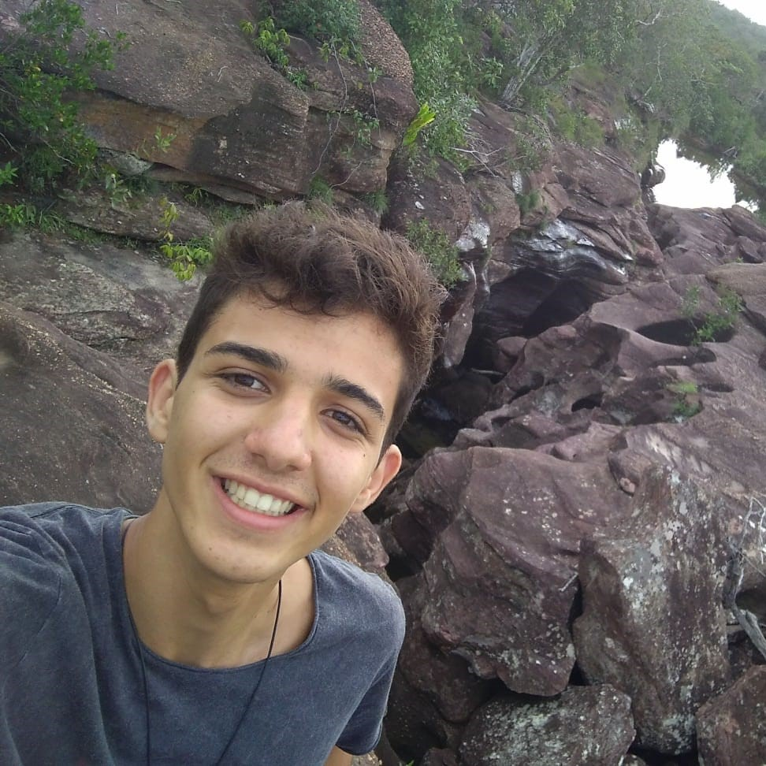

# VivaBem

  

 

&emsp;&emsp; Este repositório destina-se ao grupo 2 da matéria de Requisitos de Software da Universidade de Brasília. Possui o objetivo de analisar os requisitos funcionais e não funcionais do aplicativo **[VivaBem](https://play.google.com/store/apps/details?id=br.gov.datasus.vivabem&hl=pt_BR&gl=US)**, utilizando conceitos aprendidos na discplina, ministrado pelo professor André Barros, na Universidade de Brasília - Gama, durante o período 2021/1.

## Equipe
 Foto | Nome | Email | GitHub |
 ---- | ---- | ----- | ------ |
 | Gabriel Avelino	 | blackzinh8@gmail.com | [@gabrielavelino](https://github.com/gabrielavelino) |
 | Guilherme Vial	| colocar e-mail | [@GRVial](https://github.com/GRVial) |
 | Italo Serra	 | italoserra99@gmail.com | [@italofernandes13](https://github.com/italofernandes13) |
 | João Victor	| joaovaladao161274@gmail.com | [@joaovaladao](https://github.com/joaovaladao) |
 | Nathan Serra	| 170112004@aluno.unb.br | [@Nathanserra](https://github.com/Nathanserra) |
 | Philipe Serafim	| philipeserafim@gmail.com | [@philipeserafim](https://github.com/philipeserafim) |
