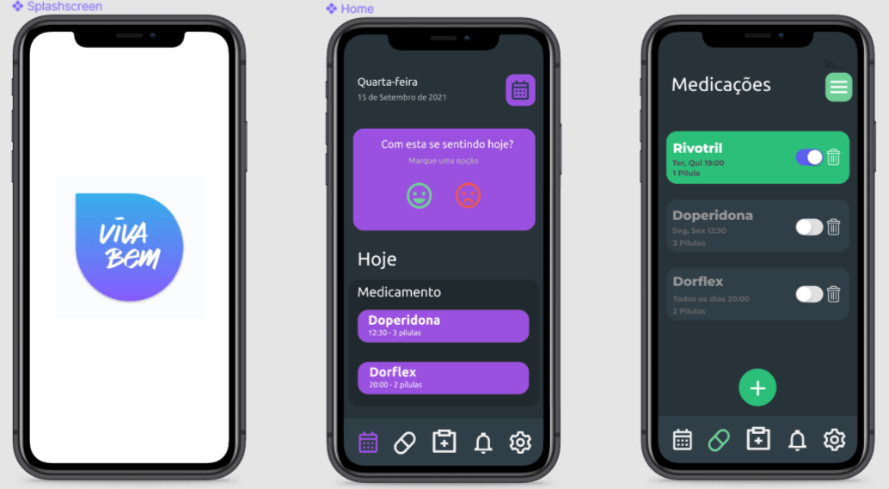

## <a>Introdução</a>

Com base no desenvolvimento das entregas anteriores, o protótipo serve para confirmar se o que planejamos e construímos foi realmente atingido de forma clara e eficiente.

## <a>Objetivo</a>

Com esse protótipo, queremos ter a certeza de que baseado no aplicativo original, conseguimos corresponder os requisitos elicitados nas etapas anteriores. Assim, inserimos esses requisitos na prototipagem básica abaixo.

## <a>Protótipo</a>

O protótipo abaixo foi desenvolvido com base nos requisitos presentes no aplicativo original VivaBem, e com ele, desenvolvemos com base no que priorizamos nas etapas anteriores. Criamos os protótipos das principais funcionalidades disponíveis no aplicativo. Construimos esses designs no site <a>Figma</a> que é especializado para esse tipo de situação.

### <a>Primeira imagem</a>

- <a>Splash Screen:</a> A primeira tela na imagem abaixo representa a tela de abertura do aplicativo, mostrando o símbolo que vem ser a representação do app.
- <a>Home:</a> A segunda tela representa a página principal do aplicativo com os medicamentos cadastrados anteriormente e com a pergunta do dia, podendo trocar essa pergunta por um display de calendário (Botão superior direito).
- <a>Medicações:</a> A última tela da primeira imagem representa a aba medicações, que serve para cadastrar os medicamentos e gerenciá-los. O botão superior direito serve para ver as outras funcionalidade da página como o histórico de dispensações e histórico de esquemas.

<figcaption>Figura 1: Telas (SplashScreen, Home, Medicações)</figcaption>

### <a>Segunda imagem</a>

- <a>Exame Resumo:</a> A primeira tela na imagem abaixo representa a aba de exames, onde pode cadastrar e gerenciar esses exames criados.
- <a>Exame Resultado:</a> A segunda tela representa a segunda parte da área de exames, mostrando os exames ja registrados e finalizados, mostrando também se ele tem relação com o SUS ou feito a parte.
- <a>Notificações:</a> A terceira tela da imagem representa a aba de notificações, onde mostra as últimas notificações sobre o aplicativo.

<figcaption>Figura 2: Telas (Exames Resumo, Exames Resultados, Notificações)</figcaption>

### <a>Terceira imagem</a>

- <a>Mais opções:</a> A última imagem do protótipo mostra a última aba, a mais opções onde tem as novidades, configurações gerais, sair do aplicativo, termos de uso, rendimento, informações de emergência, interação medicamentosa e efeitos colaterais. Álem de mostrar a carteirinha do SUS do usuário.

<figcaption>Figura 3: Tela Mais opções</figcaption>

 

O protótipo foi desenvolvido no Figma e pode ser acessado através deste <a href='https://www.figma.com/file/bO96riH4QxhCmxWzkDSCuL/VivaBem?node-id=0%3A1' target='_blank'>link</a>.

## Referências e Bibliografias

> SOMMERVILLE, Ian. Engenharia de Software. 9.ed. São Paulo: Pearson Prentice Hall, 2011. 529 p.

## Versionamento

| Versão | Data | Modificação | Autor |
|--|--|--|--|
| 1.0 | 15/09/2021 | Criação do documento | Gabriel Avelino|
| 2.0 | 16/09/2021 | Criação do protótipo | Gabriel Avelino |
| 3.0 | 17/09/2021 | Revisão do documento| Ítalo Serra (Revisor) |