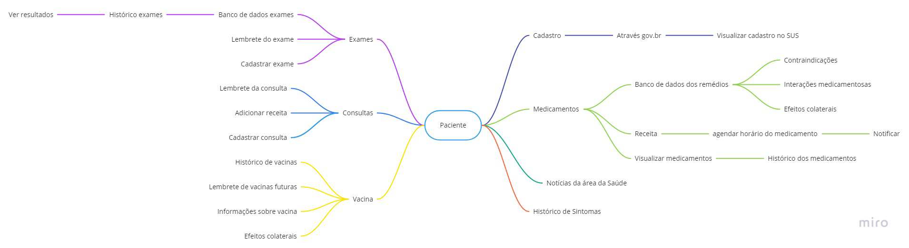

## <a>Introdução</a>

Brainstorming é uma técnica que funciona baseada no compartilhamento espontâneo de ideias, buscando encontrar alternativas para o problema proposto e/ou gerar insights. Para que o brainstorming consiga resultados satisfatórios é necessário que: seja completamente livre de críticas, pois toda ideia é válida; e tenha uma quantidade suficiente de participantes.
O importante ressaltar que não se deve perder o foco do problema enquanto estiver na dinâmica.

## <a>Metodologia</a>

Os membros do grupo se reuniram através de uma reunião realizada pelo Teams e com auxílio do Miro fomos anotando, agrupando e interligando as ideias de requisitos que o aplicativo possuiria.

## <a>Resultado</a>

Por meio das ideias dos participantes e do acordo entre eles, os seguintes requisitos foram levantados:

<figcaption> Figura 1 - Resultado do brainstorming </figcaption>

### <a>Exames</a>

- O usuário deve poder acessar os exames

Todos os participantes concordam que seria uma boa funcionalidade que o usuário pudesse visualizar os exames já cadastrados e cadastrar novos exames.

### <a>Consultas</a>

- O usuário deve poder acessar as consultas

Assim como um alarme, todos os participantes concordam que seria uma boa funcionalidade que o usuário pudesse visualizar os consultas já cadastradas e ser notificadas adequadamente e ,também, cadastrar novos consultas.

### <a>Vacinas</a>

- O usuário deve poder acessar as vacinas

Todos os participantes concordam que uma boa funcionalidade seria que o usuário conseguisse acessar as vacinas que ele já tomou e as que precisa tomar.

### <a>Medicamentos</a>

- O usuário deve poder acessar medicamentos

Todos os participantes concordam que uma boa funcionalidade seria que o usuário conseguisse consultar os medicamentos cadastrados na base de dados e utilizá-la quando forem indicar quais medicamentos estão utilizando no momento.

### <a>Cadastrar</a>

- O usuário deve poder cadastrar

O aplicativo deve permitir o usuário logar/deslogar de sua contar, pois ele deve ter acesso aos seus dados, caso o usuário trocar de aparelho.

### <a>Notícias</a>

- O usuário deve poder visualizar as últimas notícias da área da saúde

O aplicativo disponibilizar notícias relacionadas à saúde e bem estar no geral.

### <a>Histórico de Sintomas</a>

- O O usuário deve poder acessar o histórico de sintomas

Os participantes pensam que o usuário conseguir ver o histórico de sintomas seria uma funcionalidade importante, pois ajudaria o usuário analisar seus sintomas à algum medicamento.

## <a>Requisitos Elicitados</a>

|  ID   | Requisito elicitado                                                  |
| :---: | :------------------------------------------------------------------- |
| #RF01 | O usuário pode cadastrar um exame                                    |
| #RF02 | O usuário pode ver o resultado dos exames                            |
| #RF03 | O usuário deve ter acesso ao histórico de exames                     |
| #RF04 | O usuário pode agendar um lembrete para um exame                     |
| #RF05 | O O usuário deve poder acessar o histórico de sintomas               |
| #RF06 | O usuário deve poder visualizar as últimas notícias da área da saúde |
| #RF07 | O usuário deve poder utilizar seu cadastro no gov.br                 |
| #RF08 | O usuário deve ter acesso às suas informações presentes no gov.br    |
| #RF08 | Possuir um histórico de vacinação do usuário                         |
| #RF09 | Ter lembretes de vacinações futuras                                  |
| #RF10 | Possuir informações sobre cada vacina                                |
| #RF11 | Saber efeitos colaterais das vacinas                                 |
| #RF12 | O usuário pode cadastrar uma consulta                                |
| #RF13 | O usuário pode agendar um lembrete para uma consulta                 |
| #RF14 | O usuário pode adicionar a receita médica de uma consulta            |
| #RF15 | Sugerir lista do SICLOM na pesquisa do remédio                       |
| #RF16 | Sugerir contra indicações quanto ao uso de certas medicações         |
| #RF17 | Alertar o usuário quanto a efeitos colaterais                        |
| #RF18 | Agendar medicamento                                                  |
| #RF19 | Visualizar rendimento diário de uso de medicamento                   |

## <a>Versionamento</a>

|    Data    | Versão |      Alteração       | Responsável(eis) |
| :--------: | :----: | :------------------: | :--------------: |
| 19/08/2021 |  1.0   | Criação do documento | Gabriel Avelino, Guilherme Vial, Italo Fernandes, João Victor, Nathan Fernandes, Philipe Serafim|

## <a>Bibliografia</a>

VAZQUEZ C. E.; SIMÕES G. S. <strong>Engenharia de Requisitos</strong> ed. Brasport, 2016.
