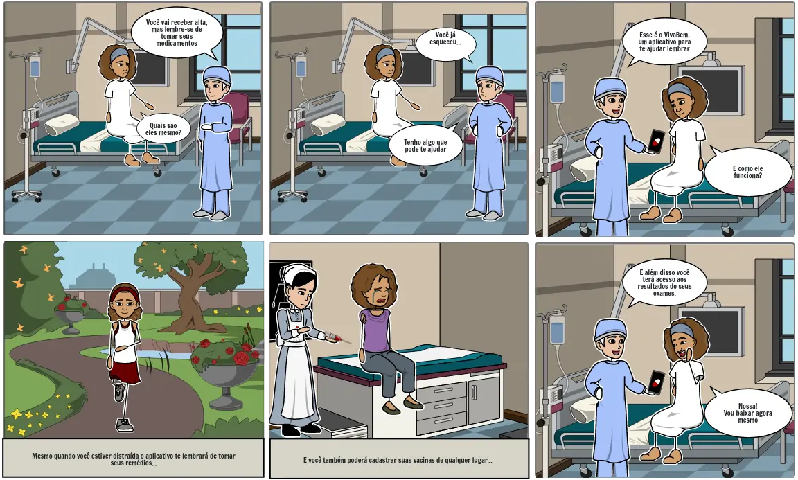

## <a>Introdução</a>

O storyboard é um exemplo de prototipagem de baixa fidelidade que costuma ser usado em conjunto com cenários. O storyboard é uma sequência de desenhos quadro a quadro com o esboço das diversas cenas pensadas, que mostram como um usuário pode progredir em uma tarefa usando o produto em desenvolvimento. Pode ser uma série de esboços de tela ou uma série de cenas mostrando como um usuário pode executar uma tarefa usando um dispositivo interativo.

<figcaption>Tabela 1: Storyboard do aplicativo VivaBem</figcaption>

## <a>Bibliografia</a>

- Barbosa, S. D. J.; Silva, B. S. da; Silveira, M. S.; Gasparini, I.; Darin, T.; Barbosa, G. D. J. (2021) Interação Humano-Computador e Experiência do usuário. Autopublicação.

## <a>Versionamento</a>

|Data|Versão|Descrição|Autor|
|--|--|--|--|
|22/09/2020| 0.1 | Abertura do documento e textos| João Victor Valadão de Brito |
|22/09/2020| 0.2 | Adicionando Storyboard| João Victor Valadão de Brito |