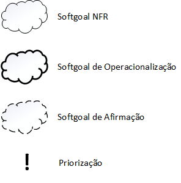

## <a>Introdução</a>

O NFR Framework, acrônimo para Non Functional Requirements, é uma abordagem que objetiva representar e analisar Requisitos Não Funcionais, visando ajudar os desenvolvedores na implementação de soluções personalizadas considerando as características do domínio ou do sistema sendo tratado.

O NFR Framework foi adotado por propor uma abordagem específica para o tratamento de Requisitos Não Funcionais utilizando softgoals, objetivos que não possuem uma clara definição nem critérios de satisfação bem elaborados. Os softgoals são utilizados para representar Requisitos Não-Funcionais e podem estar inter-relacionados, expressando a influência de um softgoal em outro.

### <a>Softgoals</a>

Os softgoals são representados através do SIG (Softgoal Interdependency Graph), que registra as considerações do desenvolvedor a respeito dos softgoals e mostra suas interdependências.

Cada softgoal pode ser decomposto em outros softgoals, sendo os tipos de decomposição:

- Decomposição de Softgoal NFR: Responsável por refinar ou subdividir um softgoal NFR em outros específicos. Isso ajuda a dividir grandes problemas em problemas menores.

- Decomposição de Operacionalização: Responsável por subdividir um softgoal de operacionalização em outros softgoals de operacionalização mais específicos. Operacionalizações são úteis para definir uma solução geral e refinar soluções mais específicas.

- Decomposição de Afirmação (Claims): Responsável por refinar um softgoal de afirmação em outros softgoals de afirmação. Pode apoiar ou negar justificativas específicas de projeto.

- Priorização: A priorização é o tipo de decomposição onde ocorre o refinamento de um softgoal em outro softgoal com o mesmo tipo e tópicos, porém com uma prioridade associada.

<figcaption>Figura 1 - Representação de softgoals. Fonte: CHUNG, 2000 </figcaption>

### <a>Contribuições</a>

Além dos tipos de softgoals, também é possível determinar como os softgoals interagem entre si, ou seja, como um softgoal contribuí com outro para sua aceitação ou negação.

<!-- Mudar parágrafo acima conforme o que for feito -->

| Tipo                        | Descrição                                                                                                                                                                                                                                                                                        |
| :-------------------------- | :----------------------------------------------------------------------------------------------------------------------------------------------------------------------------------------------------------------------------------------------------------------------------------------------- |
| <strong>AND</strong>        | Se todos os softgoals descendentes forem satisfeitos, os softgoals ascendentes serão satisfeitos                                                                                                                                                                                                 |
| <strong>OR</strong>         | Se pelo menos um softgoals descendente for satisfeito, os softgoals ascendentes serão satisfeitos                                                                                                                                                                                                |
| <strong>MAKE(++) </strong>  | Sendo uma contribuição suficientemente positiva, se um softgoal descendente for satisfeito, o softgoal pai (ascendente) também será satisfeito.                                                                                                                                                  |
| <strong>BREAK(--)</strong>  | Sendo uma contribuição suficientemente negativa, se um softgoal descendente for negado, o softgoal pai (ascendente) também será negado.                                                                                                                                                          |
| <strong>HELP(+)</strong>    | Fornece uma contribuição parcialmente positiva, se um softgoal descendente for parcialmente satisfeito, o softgoal ascendente será parcialmente satisfeito.                                                                                                                                      |
| <strong>HURT(-)</strong>    | Fornece uma contribuição parcialmente negativa, se um softgoal descendente for parcialmente negado, o softgoal ascendente será parcialmente satisfeito.                                                                                                                                          |
| <strong>UNKNOWN(?)</strong> | Contribuição desconhecida entre softgoals, podendo ser tanto positiva quanto negativa.                                                                                                                                                                                                           |
| <strong>EQUALS</strong>     | Determinar que o softgoal descendente só será satisfeito se o softgoal ascendente for satisfeito, ou que o softgoal descendente só será negado se o softgoal ascendente também for negado.                                                                                                       |
| <strong>SOME</strong>       | Utilizado quando se sabe o sinal da contribuição (positiva ou negativa) mas não se sabe sua extensão (parcial ou total). Desse modo caso exista dúvida entre HELP ou MAKE deve-se utilizar <strong>SOME +</strong> ou <strong>SOME -</strong> quando a incerteza for em relação a HURT ou BREAK. |

<figcaption>Tabela 1 - Contribuições entre softgoals. Fonte: CHUNG, 2000</figcaption>

## <a>Metodologia</a>

Para construção do diagrama, foram utilizados os requisitos não funcionais elicitados.

<figcaption><a href="./../../img/nfr_vivabem.png">Figura 2</a> - Diagrama NFR. Autor: Philipe Serafim</figcaption>

## <a>Avaliação</a>

"O procedimento de avaliação determina o grau que os requisitos não funcionais são satisfeitos por um conjunto de decisões. Dessa forma, o procedimento de avaliação determina
se cada softgoal ou interdependência do SIG foi suficientemente satisfeito. Para isso, são
atribuídos rótulos para os softgoals. Os tipos de rótulos utilizados são: satisfeito, fracamente satisfeito, negado, fracamente negado, conflitante, indeterminado." (SILVA, Reinaldo Antônio da. NFR4ES: um Catálogo de Requisitos Não-Funcionais para Sistemas Embarcados.)

<figcaption>Figura 3 - Tipo de Rótulos. Autor: SILVA, Reinaldo Antônio da</figcaption>

### <a>Nossa Avaliação</a>

<figcaption><a href="./../../img/nfr-vivabem-avaliacao.png">Figura 4</a> - Avaliação Diagrama NFR. Autor: Nathan Serra</figcaption>

## <a>Bibliografia</a>

CHUNG, L.; NIXON, B. A.; YU, E.; MYLOPOULOS, J. Non-functional requirements in software engineering. Springer Science & Business Media: [s.n.], 2000. v. 5.

SILVA, Reinaldo Antônio da. NFR4ES: um Catálogo de Requisitos Não-Funcionais para Sistemas Embarcados. Dissertação (Mestrado) – Universidade Federal de Pernambuco, 2019.

SOMMERVILLE, I. Software engineering. 8. ed ed. Harlow: Addison-Wesley [u.a.], 2007.

## <a>Versionamento</a>

|    Data    | Versão |             Alteração             | Responsável(eis) |
| :--------: | :----: | :-------------------------------: | :--------------: |
| 09/09/2021 |  1.0   |       Criação do documento        |  Guilherme Vial  |
| 09/09/2021 |  1.1   |       Adição de introdução        |  Guilherme Vial  |
| 09/09/2021 |  1.2   | Softgoals - Tipos e contribuições | Philipe Serafim  |
| 09/09/2021 |  1.3   |           Diagrama NFR            | Philipe Serafim  |
| 10/09/2021 |  1.4   |           Avaliação e Revisão     | Nathan Serra     |