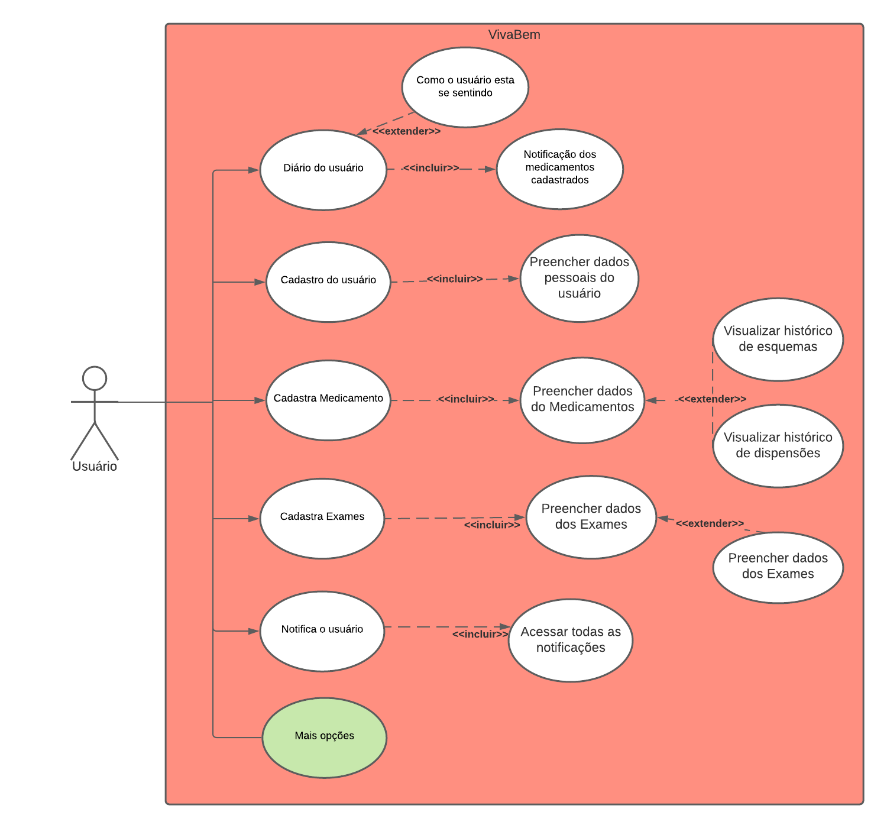
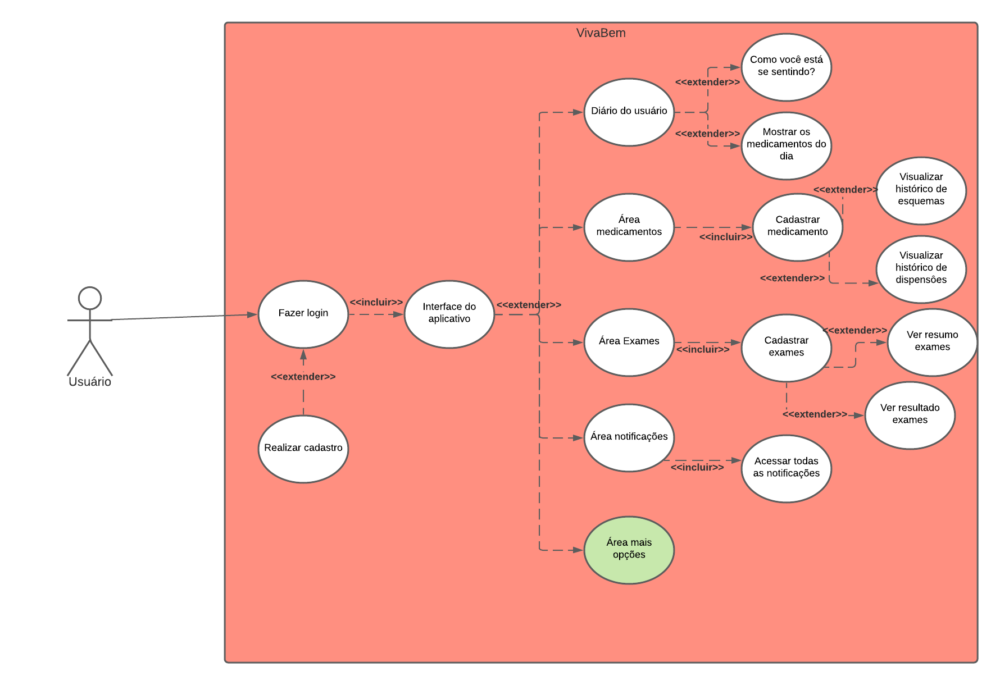
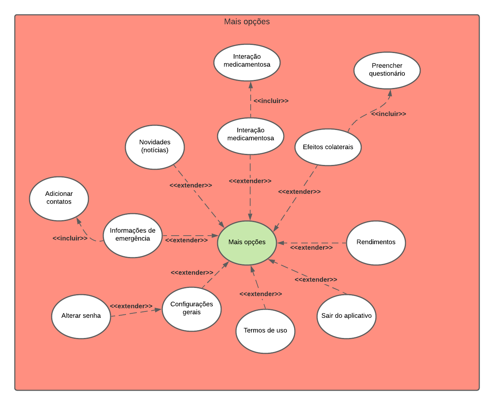
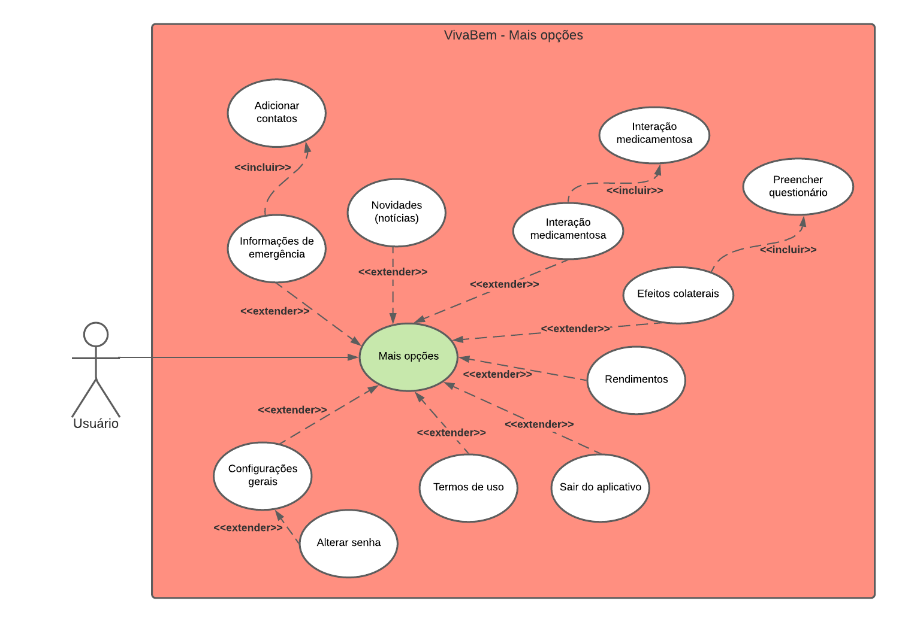

# <a>Introdução </a>

Os Casos de Uso são utilizados para descrever um conjunto de ações que um sistema ou um conjunto de sistemas deve desempenhar em
colaboração com um ou mais usuários externos ao sistema, ou seja tem como objetivo descrever como será o uso de uma funcionalidade de um sistema. Nosso grupo escolheu diagrama de estados da UML para descrever como ocorre as interações do usuário com o sistema. Definindo os atores (pessoas ou outros sistemas), as classes de interação (ações dos usuários ou do sistema), os relacionamentos (ligação entre os atores e a interação) e o limite do sistema (escopo do sistema para os casos de uso).

# <a>Diagramas </a>

O grupo fez os diagramas de caso de uso usando o <a>Lucid Chart</a>, aplicativo onde facilitou o uso de diagramas UML. Segue abaixo os diagramas realizados pelo grupo.

# <a>Caso geral de uso</a>

## <a>Primeira versão do diagrama</a>

<figcaption>Figura 1: Caso de uso geral - Autor: Gabriel Avelino</figcaption>

 

## <a>Versão após a inspeção</a>

<figcaption>Figura 2: Caso de uso geral (Após a etapa de inspeção) - Autor: Gabriel Avelino</figcaption>

 

## <a>Caso de uso específico - "Mais opções"</a>

Diagrama destaca o caso de uso específico da elipse verde do diagrama acima, mostrando os casos de uso do caso "Mais opções".

<figcaption>Figura 2: Caso de uso específico do "Mais opções" - Autor: Gabriel Avelino</figcaption>

 

<figcaption>Figura 2: Caso de uso específico do "Mais opções" (Após a fase de inspeção) - Autor: Gabriel Avelino</figcaption>

 

# <a>Descrição dos casos de uso</a>

## <a>Cadastrar usuário</a>

| Caso 1          | Informações                                                                                                                                                                                                                                                 |
| --------------- | ----------------------------------------------------------------------------------------------------------------------------------------------------------------------------------------------------------------------------------------------------------- |
| Descrição       | Quando o aplicativo é acessado pela primeira vez após o download, é necessário realizar login utilizando uma conta governamental                                                                                                                            |
| Ator(es)        | Usuário                                                                                                                                                                                                                                                     |
| Pré-condições   | Ter acesso à internet e o aplicativo instalado                                                                                                                                                                                                              |
| Fluxo           | 1 - O ator precisa abrir o aplicativo  2 - Necessita inserir o CPF do autor, para vincular a uma conta governamental  3 - Necessita inserir a senha da conta GOV.br  4 - O autor então terá de resolver um CAPTCHA e então é finalizado o login |
| Pós-condições   | O autor terá acesso a todas as funcionalidades do aplicativo                                                                                                                                                                                                |
| Rastreabilidade | Pasta: Elicitação de Requisitos/Técnicas/Requisitos elicitados -> RF01, RF02, RF03, RF04 e RF26                                                                                                                                                             |
<figcaption>Tabela 1 - Descrição de login</figcaption>

 

## <a>Cadastrar medicação</a>

| Caso 2          | Informações                                                                                                                                                                                                                                                                                                                                                                                          |
| --------------- | ---------------------------------------------------------------------------------------------------------------------------------------------------------------------------------------------------------------------------------------------------------------------------------------------------------------------------------------------------------------------------------------------------- |
| Descrição       | Quando é necessário tomar alguma medicação, precisa cadastrar ela no aplicativo para ser lembrado                                                                                                                                                                                                                                                                                                    |
| Ator(es)        | Usuário                                                                                                                                                                                                                                                                                                                                                                                              |
| Pré-condições   | Ter acesso à internet e o aplicativo instalado                                                                                                                                                                                                                                                                                                                                                       |
| Fluxo           | 1 - O ator precisa ir na aba de medicamentos 2 - Necessita ir em adicionar medicamento 3 - Precisa informar o nome  do medicamento 4 - Precisa incluir as informações do medicamento 5 - Precisa incluir o cronograma do medicamento 6 - Precisa incluir a duração e o laudo do medicamento 7 - Após colocar todas a informações do medicamento, precisa concluir o cadastro |
| Pós-condições   | O usuário será notificado do medicamento, e poderá visualizar os dados do medicamento                                                                                                                                                                                                                                                                                                                |
| Rastreabilidade | Pasta: Elicitação de Requisitos/Técnicas/Requisitos elicitados -> RF05, RF13, RF15, RF16, RF17, RF18, RF27 e RF28                                                                                                                                                                                                                                                                                    |
<figcaption>Tabela 2 - Descrição do cadastro de medicação</figcaption>

 

## <a>Cadastrar exame</a>

| Caso 3          | Informações                                                                                                                                                                                                   |
| --------------- | ------------------------------------------------------------------------------------------------------------------------------------------------------------------------------------------------------------- |
| Descrição       | Quando é feito um agendamento de algum exame, é necessário realizar um cadastro desse exame                                                                                                                   |
| Ator(es)        | Usuário                                                                                                                                                                                                       |
| Pré-condições   | Ter acesso à internet e o aplicativo instalado                                                                                                                                                                |
| Fluxo           | 1 - O ator precisa ir na aba de exames 2 - Necessita ir em adicionar exame 3 - Precisa incluir as informações do exame 4 - Após colocar todas a informações do exame, precisa concluir o cadastro |
| Pós-condições   | O usuário será notificado do exame, e poderá visualizar os dados do exame                                                                                                                                     |
| Rastreabilidade | Pasta: Elicitação de Requisitos/Técnicas/Requisitos elicitados -> RF08, RF09, RF10, RF11, RF12, RF29, RF30, RF31 e RF32                                                                                       |
<figcaption>Tabela 3 - Descrição do cadastro de exame</figcaption>

 

## <a>Diário de usuário</a>

| Caso 4          | Informações                                                                                                                                                                                                                                                                                                           |
| --------------- | --------------------------------------------------------------------------------------------------------------------------------------------------------------------------------------------------------------------------------------------------------------------------------------------------------------------- |
| Descrição       | O ator poderá criar um diário com emojis de como está se sentindo e relatar qualquer efeito colateral (evento adverso) que sentir                                                                                                                                                                                     |
| Ator(es)        | Usuário                                                                                                                                                                                                                                                                                                               |
| Pré-condições   | Ter acesso à internet e o logado no aplicativo                                                                                                                                                                                                                                                                        |
| Fluxo           | 1 - O ator precisa abrir o aplicativo 2 - Cadastrar um medicamento 3 - Navegar ate a página de Diário 4 - O ator pode relatar como está seu estado de saúde 5 - O ator pode relatar efeito colateral do medicamento selecionado 6 - O ator pode visualizar a quantidade de medicamentos pendentes |
| Pós-condições   | Caso o ator relatar algum efeito colateral ou relatar que seu estado de saúde não é bom, o ator será direcionado a um questionário, que após finalizado, mantém um registro das suas respostas                                                                                                                        |
| Rastreabilidade | Pasta: Elicitação de Requisitos/Técnicas/Requisitos elicitados -> RF05, RF06, RF07, RF08, RF15, RF16, RF21, RF25 e RF34                                                                                                                                                                                               |
<figcaption>Tabela 4 - Descrição do sistema de notificações</figcaption>

 

## <a>Acessar notificações</a>

| Caso 5          | Informações                                                                                                                                                                                                           |
| --------------- | --------------------------------------------------------------------------------------------------------------------------------------------------------------------------------------------------------------------- |
| Descrição       | Ao iniciar a aplicação, o ator pode verificar se ele tem novas notificações e visualizá-las clicando no ícone "Notificações"                                                                                          |
| Ator(es)        | Usuário                                                                                                                                                                                                               |
| Pré-condições   | Ter acesso à internet e o logado no aplicativo                                                                                                                                                                        |
| Fluxo           | 1 - O ator precisa abrir o aplicativo 2 - Necessita realizar o login (Caso 2) 3 - Na tela inicial, o ator clica no ícone "Notificações" 4 - O ator pode verificar se existem notificações e visualizá-las |
| Pós-condições   | Possibilita manter o ator informado pelas notificações recebidas                                                                                                                                                      |
| Rastreabilidade | Pasta: Elicitação de Requisitos/Técnicas/Requisitos elicitados -> RF22, RF23, RF27 e RF28                                                                                                                             |
<figcaption>Tabela 5 - Descrição do sistema de notificações</figcaption>

 

## <a>Mais Opções</a>

| Caso 6          | Informações                                                                                                                              |
| --------------- | ---------------------------------------------------------------------------------------------------------------------------------------- |
| Descrição       | Ao acessar a tela inicial, o ator pode verificar todas as outras opções disponibilizadas pelo aplicativo clicando no ícone "Mais opções" |
| Ator(es)        | Usuário                                                                                                                                  |
| Pré-condições   | O autor deve estar logado no aplicativo                                                                                                  |
| Fluxo           | 1 - O ator precisa abrir o aplicativo 2 - Necessita fazer login 3 - Na tela inicial, o ator clica no ícone "Mais opções"         |
| Pós-condições   | O ator pode usufruir de todas as outras opções que o aplicativo oferece                                                                  |
| Rastreabilidade | Pasta: Elicitação de Requisitos/Técnicas/Requisitos elicitados -> RF06, RF07, RF14, RF19, RF20, RF24, RF26 e RF33                        |
<figcaption>Tabela 6 - Descrição do sistema de notificações</figcaption>

 

## <a>Referências e Bibliografias</a>

- Milene Serrano; Maurício Serrano; Interação Humano-Computador e Requisitos de Software. Slide, aula 13, Elicitação e Modelagem de Requisitos.

## <a>Versionamento</a>
| Versão | Data       | Modificação                                  | Autor                             |
| ------ | ---------- | -------------------------------------------- | --------------------------------- |
| 1.0    | 29/08/2021 | Criação do documento, Introdução             | João Victor Valadão               |
| 1.0    | 29/08/2021 | Criação dos diagramas                        | Gabriel Avelino e Ítalo Serra     |
| 1.2    | 29/08/2021 | Criação das tabelas de caso de uso           | João Victor e Ítalo Serra         |
| 1.3    | 29/08/2021 | Criação das tabela caso de uso "Mais Opções" | João Victor e Ítalo Serra         |
| 1.4    | 29/08/2021 | Revisão do documento                         | Gabriel Avelino e Philipe Serafim |