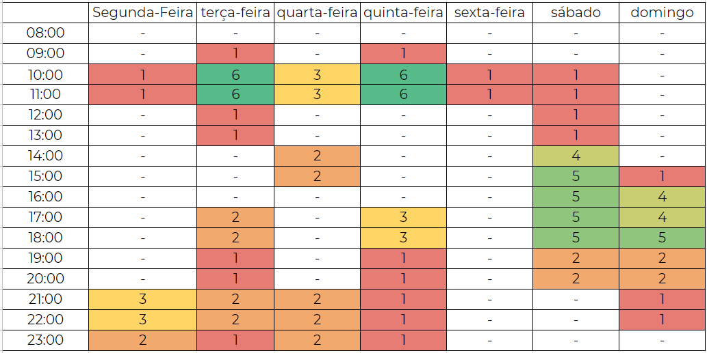

# Planejamento

## <a>Metodologia</a>

### <a>Agile</a>

Nosso grupo optou por utilizar as metodologias ágeis devido a sua simplicidade, e priorizando acima de tudo a comunicação entre a equipe. Dessa forma é estipulado entregas semanais, previamente decididas em reuniões, em que cada participante é delegado uma função e são decididas as tarefas de todos os membros. Seguindo os princípios do Manifesto Ágil, que defende o planejamento adaptativo por meio de Inteligência Coletiva, nosso time se organiza e focados na melhor maneira de desenvolver o projeto.

#### <a>Reuniões semanais</a>

As reuniões são agendadas toda semana para dividir tarefas e discutir sobre quais são as melhores maneiras de desenvolver este projeto. Acontecerá principalmente nos horários das aulas, quando não forem ministradas ou estiverem disponibilizadas assíncrona.

#### <a>Criação de Issues</a>

Após as reuniões são abertas novas Issues, listando as tarefas que devem ser concluídas, e seus respectivos prazos de entrega. Assim foram criadas novas Labels responsáveis por informar o status daquela Issue, e quando concluída é fechada. Caso o integrante responsável por quela Issue encontrar dificuldades, pode utilizar a Label "help wanted" e assim descrever a situação para que os outros participantes possam o ajudar.

Adotamos um template simples para a criação de Issue, no qual é necessário informar uma breve descrição da tarefa a ser realizada e uma lista contendo os objetivos. Também é passado uma lista de critérios de aceitação, para que após finalizada esta issue possa ser avaliada por outro integrante do grupo.

### <a>XP - Extreme Programming</a>

 &emsp;&emsp; Para o nosso projeto decidimos utilizar <b>Extreme Programming (XP)</b> que é uma metodologia de desenvolvimento ágil para pequenas e médias equipes que desenvolvem software baseado em requisitos vagos e que se modificam rapidamente. O <b>XP (Extreme Programming ou Programação Extrema)</b> é focada no desenvolvimento de software que possui valores e princípios, onde são fundamentados por um conjunto de práticas. Além disso, o <b>XP</b> também possui funções bem definidas para seus membros.

 &emsp;&emsp; O XP tem <b>cinco</b> valores muito importantes que fazem a base de um desenvolvimento de projeto ágil. 

#### <a>Valores do XP</a>
* <b>Comunicação:</b> A má comunicação é motivo de insucesso em todo tipo de projeto, inclusive nos projetos de software. Além de atrapalhar o engajamento dos membros no trabalho, aumenta a chance de erros no programa e na junção com as outras partes de outros membros. Por isso uma boa comunicação é fundamental.
  

* <b>Simplicidade:</b> Manter a simplicidade é difícil, entretanto, possibilita que tudo esteja no controle. É um dos princípios do XP advindos do JIT.
 

* <b>Feedback:</b> Fator altamente importante nos dias atuais, pois permite que outros além do grupo enxergue os erros e dificuldades do programa, melhorando-o cada vez mais.
 

* <b>Coragem:</b> Um dos valores mais importantes é ter coragem para testar novas ideias, substituir antigas, mudar o código, corrigir erros.
  

* <b>Respeito:</b> Ultimo mas não menos importante, é ter respeito com a comunidade ao seu redor, com os membros do seu grupo e meio social, para manter um ambiente agradável para todos trabalharem.
  

#### <a>Práticas do XP</a>

 &emsp;&emsp;O XP além desses valores listados acima, ele possui um conjunto de princípios que devem ser seguidos para que tenha uma boa prática de desenvolvimento no projeto. Abaixo foi listado algumas práticas escolhidas pelo nosso grupo para serem utilizadas.  

* <b>Programação em par:</b> Prática de programar a dois, assim, com duas pessoas olhando o mesmo código fonte, a chance desse mesmo código conter bugs e falhas é diminuída pela metade. Ela é uma das práticas primordiais do XP, pois dois programadores fazendo o trabalho juntos acaba agregando muito para o trabalho em equipe.

* <b>Ritmo sustentável:</b> Manter um ritmo de trabalho constante com qualidade, onde eles estejam atentos e dispostos.

* <b>Releases curtos:</b> As liberações de pequenas versões funcionais do projeto auxiliam muito no processo de aceitação por parte do cliente que já pode testar uma parte do sistema. Além de que a chance de reverter os erros/bugs do sistema ficam mais fáceis de consertar por voltar para uma versão mais perto da destinada.

## <a>Ferramentas</a>

 | **Ferramenta**                                 | **Nome**                       | **Finalidade**                                                                                                                                         |
 | ---------------------------------------------- | ------------------------------ | ------------------------------------------------------------------------------------------------------------------------------------------------------ |
 |                | Github                         | Github é uma ferramenta para controle de versionamento e armazenamento dos arquivos de documentação.                                                   |
 |        | Lucid Chart                    | Lucid Chart é uma ferramenta que permite criar desenhos, gráficos e diagramas de forma eficiênte e simples.                                            |
 |         | Microsoft Teams                | Plataforma para realização de reuniões em chamada de voz e vídeo.                                                                                      |
 |            | Telegram                       | Uma das maiores ferramentas de comunicação da atualidade, irá permitir ao grupo uma forma de comunicação de forma ágil e fácil durante todo o projeto. |
 |                | Visual Studio Code             | Principal ferramenta de edição d textos no projeto.                                                                                                    |
 |                | MKdocs                         | Gerador de site estático minimalista, será usado para criar o site contendo a documentação do projeto.                                                 |
 |                      | Figma                          | Editor gráfico de vetor e prototipagem de projetos de design.                                                                                          |
 |  | Fantástico Gerador de Personas | Ferramenta da rockcontent que provém a formatação e imagens para geração de personas.                                                                  |
 |                        | Miro                           | Sendo um quadro branco infinito, o Miro permite que múltiplas pessoas anotem suas ideias e interaja com as anotações de outro membro.                  |

## <a>Cronograma</a>

 &emsp;&emsp; O cronograma do projeto foi estipulado com base nas datas descritas no plano de ensino de Requisitos de Software, e possui a finalidade de organizar e realizar as atividades no prazo.

## <a>Heatmap de disponibilidade</a>

 &emsp;&emsp;O desenvolvimento dos artefatos e das atividades relacionadas à cada entrega será realizada em duplas e será revisado por um ou mais membros do grupo de acordo com a disponibilidade de cada um.

&emsp;&emsp; Também foi feito um heatmap para encontrar a intersecção de disponibilidade dos membros afim de encontrar possíveis duplas para confecção e revisão dos artefatos produzidos.

*Fig. 1: Heatmap de disponibilidade do time.*

### <a>Entregas</a>

 &emsp;&emsp;Também foram estipuladas datas para a entrega das atividades.

| Etapas |             Título             | Data Prevista |                                 Descrição                                  |
| :----: | :----------------------------: | :-----------: | :------------------------------------------------------------------------: |
|   I    |      Pré-Rastreabilidade       |  29/07-04/08  |                   Planejamento do projeto e RichPicture                    |
|   II   |   Priorização de Requisitos    |  05/08-21/08  |                           Técnicas e Priorização                           |
|  III   |    Modelagem de Requisitos     |  22/08-30/08  |           Cenários , Léxico, Use Case, Especificação Suplementar           |
|   IV   | Modelagem de Requisitos - Ágil |  31/08-11/09  |               Histórias de Usuário, Backlogs, NFR Framework                |
|   V    |     Análise de Requisitos      |  12/09-18/09  |                          Verificação e Validação                           |
|   VI   |      Pré-Rastreabilidade       |  19/09-09/10  | Gerência de Desenvolvimento de Software orientada à baseline de Requisitos |
|  VII   |         Projeto Final          |  10/10-20/10  |                Desenvolver a apresentação final do projeto                 |

## <a>Bibliografia</a>

  Integrando XP as principais metodologias ágeis. **DevMedia**, 2019.
  Disponível em: <https://www.devmedia.com.br/integrando-xp-as-principais-metodologias-ageis/30989>. 
  Acesso em: 13/08/2021

  VALENTE, M. T. <strong>Engenharia de Software Moderna</strong> ed. Moderna, 2020.

## <a>Versionamento</a>

|    Data    | Versão |                Alteração                | Responsável(eis) |
| :--------: | :----: | :-------------------------------------: | :--------------: |
| 03/08/2021 |  1.0   |          Criação do documento           |   João Victor    |
| 03/08/2021 |  1.1   |         Adicionando metodologia         | Gabriel Avelino  |
| 03/08/2021 |  1.2   |   Adicionando a tabela do cronograma    |   Ítalo Serra    |
| 03/08/2021 |  1.3   |    Adicionado tabela de ferramentas     |  Guilherme Vial  |
| 03/08/2021 |  1.4   |  Adicionado heatmap de disponibilidade  | Philipe Serafim  |
| 04/08/2021 |  1.5   |    Adicionado video de apresentação     | Philipe Serafim  |
| 19/08/2021 |  1.6   | Adicionado novas ferramentas utilizadas | Philipe Serafim  |